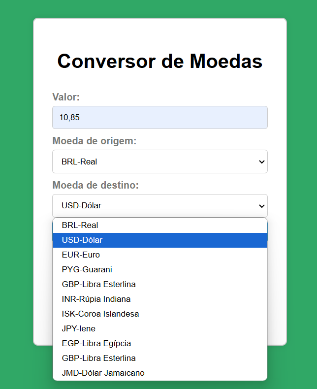
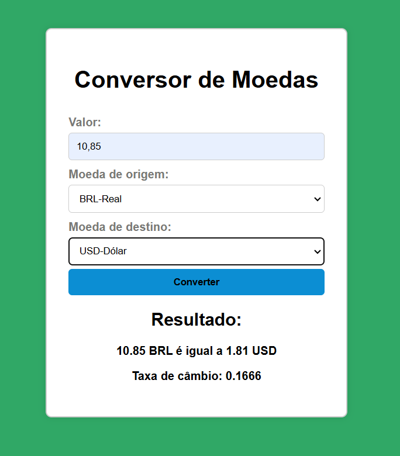

# conversor_de_moedas
Conversor de moedas com JavaScript. Utilizando a API(gratuita) AwesomeAPI, que fornece as taxas de câmbio atualizadas.  
Link API: https://docs.awesomeapi.com.br/api-de-moedas  

Deploy: https://rayydevs.github.io/conversor_de_moedas/

